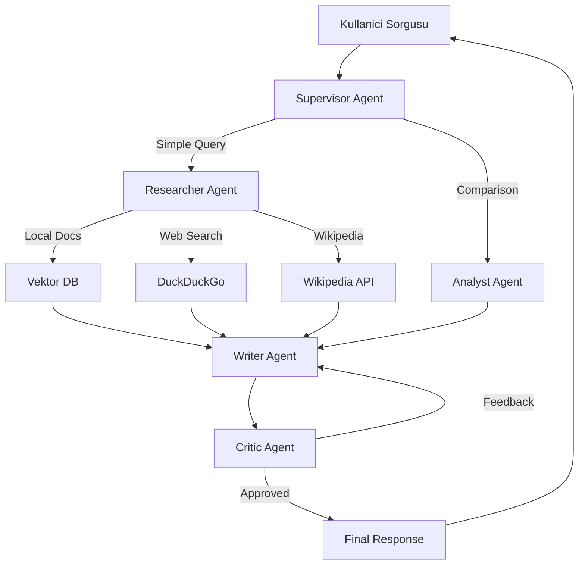

# mizan-ai

**Türk Siyasi Belgeleri için Tool-Augmented RAG (T-RAG-Ajan Platform) Çokluu**

[](#)
[](https://www.python.org/downloads/)
[](https://www.langchain.com/)
[](https://langchain.dev/langgraph/)
[](https://streamlit.io/)
[](LICENSE)

---

## Ozellikler (v6.1 - Multi-Agent T-RAG)

### Coklu-Ajan Mimarisi (LangGraph)

- **Supervisor Agent:** Kullanici sorgularini analiz eder ve dogru ajanlara yonlendirir
- **Researcher Agent:** Yerel vektor veritabani, web aramasi ve Wikipedia arastirmasi yapar
- **Analyst Agent:** Parti karsilastirmalari ve derin analiz yapar
- **Writer Agent:** Toplanan bilgilerden yanit uretir (Wikipedia oncelikli)
- **Critic Agent:** Uretilen yanitlarin kalitesini kontrol eder

### Gelismis Arama Sistemleri

- **Yerel Veritabani:** Siyasi parti programlarindan olusan ChromaDB vektor veritabani
- **Web Arama:** Guncel bilgiler icin DuckDuckGo entegrasyonu
- **Wikipedia:** LangChain WikipediaQueryRun ile Turkce/Ingilizce Wikipedia entegrasyonu
  - "kimdir", "nereli", "biyografi" gibi sorgularda otomatik Wikipedia aramasi
  - Turkce karakter donusumu ile daha iyi sonuclar

### Akilli Sorgu Analizi

- **Kisi sorgulari:** "Mansur Yavas kimdir?" gibi sorgularda Wikipedia oncelikli
- **Karsilastirma:** Iki parti arasinda karsilastirma icin Analyst'e yonlendirme
- **Derin arastirma:** "nedir", "tarihce" iceren sorgularda kapsamli arama

### Esnek LLM Destegi

- **Ollama Modelleri:** qwen2.5:7b (varsayilan), phi3, mistral, gemma3, llama3.2
- **Smart Fallback:** Ana model basarisiz olursa yedek modele gecer

### Modern Arayuz

- **Streamlit UI:** Karanlik tema ile modern tasarim
- **Multi-Agent Demo:** agent_demo.py ile ajan sistemini test edin
- **Model Karsilastirma:** model_compare.py ile 5 farkli modeli karsilastirin

---

## Mimari (Multi-Agent LangGraph)



---

## Kurulum

### Web Arayuz (Vercel - Next.js)

```bash
cd web
npm install
npm run dev
```

Tarayıcıda acin: http://localhost:3000

### Python Backend (FastAPI)

```bash
# Backend'i ayri bir terminalde calistirin
uvicorn src.api.main:app --reload
```

### Tam Kurulum

```bash
# 1. Backend (Python + Ollama)
uvicorn src.api.main:app --reload

# 2. Frontend (Next.js - yeni pencere)
cd web && npm run dev

# veya Vercel'e deploy edin
cd web && vercel deploy
```

---

## Proje Yapisi

```
mizan-ai/
├── web/                     # Next.js frontend (Vercel)
│   ├── app/                 # App router
│   │   ├── page.tsx        # Ana sayfa (chat arayuzu)
│   │   ├── layout.tsx      # Layout
│   │   └── api/chat/       # API route
│   ├── package.json        # Next.js bagimliliklari
│   └── tailwind.config.ts  # Tailwind yapilandirma
│
├── src/                     # Python backend
│   ├── app.py              # Streamlit UI
│   ├── agent_demo.py       # Multi-agent demo
│   ├── model_compare.py    # Model karsilastirma
│   ├── config.py           # Yapilandirma
│   ├── agents/             # LangGraph ajanlari
│   │   ├── graph.py       # Workflow tanimi
│   │   ├── supervisor.py  # Sorgu yonlendirme
│   │   ├── researcher.py   # Arastirma ajani
│   │   ├── analyst.py      # Analiz ajani
│   │   ├── writer.py       # Yanit uretimi
│   │   ├── critic.py       # Kalite kontrol
│   │   ├── tools.py       # Araclar (RAG, Web, Wikipedia)
│   │   ├── prompts.py     # Sistem promptlari
│   │   └── state.py       # Durum modelleri
│   ├── core/               # Temel yardimcilar
│   │   ├── parties.py     # Parti normalizasyonu
│   │   ├── llm_setup.py   # LLM kurulumu
│   │   ├── cache.py       # Onbellekleme
│   │   └── duckduckgo_search.py
│   └── api/                # FastAPI
├── data/pdfs/               # Parti belgeleri (PDF)
├── vector_db/              # ChromaDB vektor veritabanlari
├── requirements.txt       # Python bagimliliklari
└── README.md
```

---

## Hızlı Baslangic

### 1. Ollama Kurulumu

```bash
ollama pull qwen2.5:7b
```

### 2. Backend Baslatma

```bash
uvicorn src.api.main:app --reload
```

### 3. Frontend Baslatma

```bash
cd web
npm install
npm run dev
```

### 4. Vercel'e Deploy

```bash
cd web
vercel deploy
```

---

## Kullanim

### Desteklenen Partiler

| Parti | Tam Ad |
|-------|--------|
| CHP | Cumhuriyet Halk Partisi |
| AKP | Adalet ve Kalkinma Partisi |
| MHP | Milliyetci Hareket Partisi |
| IYI | IYI Parti |
| DEM | Halklarin Esitlik ve Demokrasi Partisi |
| SP | Saadet Partisi |
| ZP | Zafer Partisi |
| BBP | Buyuk Birlik Partisi |

### Ornek Sorgular

- "Mansur Yavas kimdir?"
- "CHP'nin ekonomi politikasi nedir?"
- "AKP ve CHP'nin egitim politikalarini karsilastir"
- " Saadet Partisi'nin sosyal politika yaklasimi"

---

## Test

```bash
# Lint kontrolu
ruff check .

# Format kontrolu  
black .

# Testleri calistir
pytest tests/
```

---

## Katkida Bulunma

Bu proje Turk siyasi bilgilerine erisimi demokratiklestirmeyi amaclamaktadir. Katkida bulunmak icin:

- Yeni siyasi parti belgeleri ekleyin
- UI/UX iyilestirmeleri yapin
- Sorgu performansini optimize edin

---

## Lisans

MIT License altinda dagitilmaktadır. Detaylar icin `LICENSE` dosyasina bakin.

**Gelistirici:** Baran Can Ercan

---

<div align="center">
  <b>mizan-ai</b><br>
  Turk Siyasi Belgeleri icin Tool-Augmented RAG Platformu
</div>
