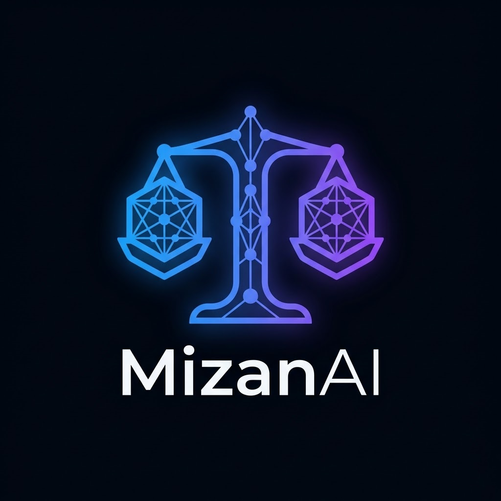
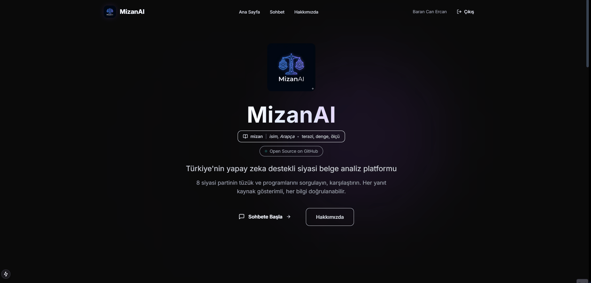
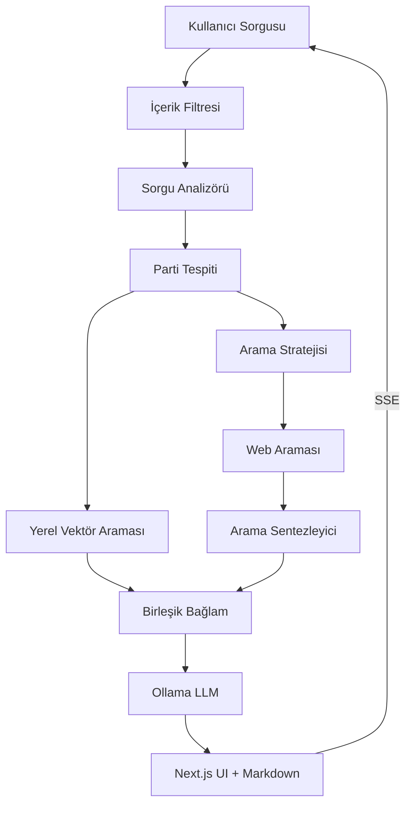

<div align="center">
  

  # MizanAI

  > **mizan** *(isim, Arapça)* — terazi, denge, ölçü

  **Türkiye'nin İlk Yapay Zeka Destekli Siyasi Belge Analiz Platformu**
</div>

[](#)
[](https://www.python.org/downloads/)
[](https://www.langchain.com/)
[](https://langchain.dev/langgraph/)
[](https://nextjs.org/)
[](https://fastapi.tiangolo.com/)
[](LICENSE)
[](https://linkedin.com/in/barancanercan)

---

## MizanAI Nedir?

MizanAI, Türkiye'deki 8 siyasi partinin (AKP, CHP, MHP, İYİ Parti, DEM, Saadet Partisi, Zafer Partisi, BBP) tüzük, program ve resmi belgelerini analiz eden, yapay zeka destekli bir belge sorgulama platformudur.

Kullanıcılar doğal dil ile sorular sorabilir, partilerin politikalarını karşılaştırabilir ve her yanıtın hangi kaynaktan geldiğini doğrulayabilir.

### 🎯 Ne İşe Yarar?

| Soru Tipi | Örnek | MizanAI Ne Yapar? |
|-----------|-------|-------------------|
| **Politika Sorgulama** | "AKP'nin ekonomi politikası nedir?" | Parti programından ilgili bölümleri bulur ve özetler |
| **Parti Karşılaştırma** | "CHP ile MHP'nin eğitim politikalarını karşılaştır" | Her iki partinin belgelerinden karşılaştırmalı analiz sunar |
| **Vaat Araştırma** | "Hangi parti asgari ücreti artırmayı vadediyor?" | Tüm parti programlarını tarar, karşılaştırmalı tablo oluşturur |
| **Kaynak Doğrulama** | "MHP'nin göç politikası nedir?" | Resmi belgeden alıntılarla yanıt verir, kaynak gösterir |

---

## 🎬 Demo

<div align="center">
  
  <p><em>MizanAI sohbet arayüzü - Gerçek zamanlı yapay zeka analizi</em></p>
</div>

---

## ✨ Özellikler

### 🤖 Multi-Agent Yapay Zeka Sistemi

| Agent | Görev |
|-------|-------|
| **Supervisor Agent** | Kullanıcı sorgularını analiz eder ve doğru ajanlara yönlendirir |
| **Researcher Agent** | Yerel vektör veritabanı, web araması ve Wikipedia araştırması yapar |
| **Analyst Agent** | Parti karşılaştırmaları ve derin analiz yapar |
| **Writer Agent** | Chain-of-Thought (CoT) ile yanıt üretir |
| **Critic Agent** | Kalite kontrol + revizyon döngüsü (max 2 iterasyon) |
| **Context Grader** | Doküman alakalılığını puanlar (eşik: 0.3) |

### 🔍 Akıllı Arama Pipeline

- **Query Analyzer**: Sorguyu alt sorulara ayırır, web gereksinimini belirler
- **Search Strategy Agent**: Sorgudan parti tespit eder, optimize arama sorguları üretir
- **Search Synthesizer Agent**: Web sonuçlarından bilgi çıkarır, alakasız sonuçları filtreler
- **Otomatik Parti Tespiti**: UI seçiminden bağımsız olarak sorgudan parti çıkarır

### 🗄️ Gelişmiş Veri Sistemleri

- **Yerel Veritabanı**: ChromaDB vektör veritabanı (parti bazlı filtreleme)
- **Web Araması**: DuckDuckGo entegrasyonu + akıllı sonuç filtreleme
- **Wikipedia**: Türkçe/İngilizce Wikipedia entegrasyonu
- **Kaynak Atıflama**: Her bilgi için kaynak URL'leri

### ⚡ Gerçek Zamanlı Akış

- **SSE (Server-Sent Events)**: Cümle bazlı streaming
- **Yazıyor Göstergesi**: Gerçekçi yazım animasyonu
- **Markdown İşleme**: Zengin formatlama ve kod blokları

### 🛡️ Güvenlik Önlemleri

- **İçerik Filtresi**: Uygunsuz içerikleri engeller
- **CORS Kontrolü**: Sadece izinli origin'ler
- **JWT Kimlik Doğrulama**: API güvenlik katmanı
- **Input Sanitization**: XSS ve injection korumaları

### 🔧 Esnek LLM Desteği

- **Ollama Modelleri**: qwen2.5:7b, qwen3.5, phi3, mistral, gemma3, llama3.2
- **Multi-Model Mimarisi**: Ana (main) ve hızlı (fast) model ayrı yapılandırılabilir
- **Tekrar Önleme**: repeat_penalty=1.2 ile tekrarları engeller
- **Akıllı Yedekleme**: Ana model başarısız olursa yedek modele geçer

---

## 🏗️ Mimari



---

## 🚀 Kurulum

### Gereksinimler

- Python 3.10+
- Node.js 18+
- Ollama (local LLM için)

### 1. Ollama Kurulumu

```bash
# Ollama'yı indirin: https://ollama.com

# Model indirme
ollama pull qwen2.5:7b
```

### 2. Python Backend

```bash
# Virtual environment oluştur
python -m venv .venv

# Windows
.venv\Scripts\activate

# Linux/Mac
source .venv/bin/activate

# Bağımlılıkları yükle
pip install -r requirements.txt

# Backend'i başlat
uvicorn src.api.main:app --reload --host 0.0.0.0 --port 8000
```

### 3. Next.js Frontend

```bash
cd web
npm install
npm run dev
```

Tarayıcıda açın: http://localhost:3000

### 4. Vercel'e Deploy

```bash
cd web
npm i -g vercel
vercel deploy
```

---

## 📁 Proje Yapısı

```
mizan-ai/
├── web/                              # Next.js 15 Frontend
│   ├── app/
│   │   ├── page.tsx                  # Ana sayfa
│   │   ├── chat/page.tsx             # Chat arayüzü
│   │   ├── about/page.tsx            # Hakkımızda
│   │   ├── layout.tsx                # Root layout
│   │   └── api/chat/stream/route.ts  # SSE streaming proxy
│   ├── components/
│   │   ├── Navbar.tsx                # Navigasyon
│   │   ├── Footer.tsx                # Footer
│   │   ├── Animated.tsx              # Framer Motion animasyonları
│   │   ├── Skeleton.tsx              # Loading states
│   │   └── ScrollToTop.tsx           # Scroll button
│   └── tailwind.config.ts            # Tailwind CSS config
│
├── src/                              # Python Backend (FastAPI)
│   ├── config.py                     # Ana yapılandırma
│   ├── api/
│   │   ├── main.py                   # FastAPI entrypoint
│   │   ├── config.py                 # CORS, JWT ayarları
│   │   ├── routers/
│   │   │   ├── query.py              # Sorgu endpoint'leri
│   │   │   ├── parties.py            # Parti listesi
│   │   │   ├── auth.py               # Kimlik doğrulama
│   │   │   └── system.py             # Health check
│   │   ├── middleware/
│   │   │   ├── auth.py               # JWT middleware
│   │   │   └── rate_limit.py         # Rate limiting
│   │   └── services/
│   │       └── query_service.py      # Ana query pipeline
│   ├── core/
│   │   ├── llm_setup.py              # Ollama/Gemini LLM kurulumu
│   │   ├── query_analyzer.py         # Sorgu analizi
│   │   ├── search_agent.py           # Arama koordinasyonu
│   │   ├── search_strategy_agent.py  # Arama stratejisi
│   │   ├── search_synthesizer_agent.py # Sonuç sentezi
│   │   ├── content_filter.py         # İçerik filtreleme
│   │   ├── parties.py                # Parti normalizasyonu
│   │   ├── cache.py                  # Embedding cache
│   │   └── duckduckgo_search.py      # Web arama
│   ├── agents/
│   │   └── grader.py                 # Bağlam değerlendirme
│   └── models.py                     # Pydantic modeller
│
├── data/pdfs/                        # Parti belgeleri (PDF)
├── vector_db/                        # ChromaDB veritabanı
├── tests/                            # Pytest testleri
├── requirements.txt                  # Python bağımlılıkları
└── README.md
```

---

## 📡 API Endpoint'leri

| Endpoint | Metod | Açıklama |
|----------|-------|----------|
| `/api/v1/query` | POST | Sorgu işleme |
| `/api/v1/query/stream` | POST | Sorgu işleme (SSE stream) |
| `/api/v1/query/compare` | POST | Parti karşılaştırma |
| `/api/v1/query/analyze` | POST | Derin analiz |
| `/api/v1/parties` | GET | Desteklenen partiler |
| `/api/v1/system/health` | GET | Sağlık kontrolü |

### Örnek Kullanım

```bash
# Sorgu endpoint'i
curl -X POST http://localhost:8000/api/v1/query \
  -H "Content-Type: application/json" \
  -d '{"question": "CHP genel başkanı kimdir?"}'

# Stream endpoint
curl -X POST http://localhost:8000/api/v1/query/stream \
  -H "Content-Type: application/json" \
  -d '{"question": "AKP ve CHP'nin ekonomi politikalarını karşılaştır"}'
```

---

## 🏛️ Desteklenen Partiler

| Kısaltma | Tam Ad | Lider |
|----------|--------|-------|
| AKP | Adalet ve Kalkınma Partisi | Recep Tayyip Erdoğan |
| CHP | Cumhuriyet Halk Partisi | Özgür Özel |
| MHP | Milliyetçi Hareket Partisi | Devlet Bahçeli |
| İYİ | İYİ Parti | Müsavat Dervişoğlu |
| DEM | Halkların Eşitlik ve Demokrasi Partisi | Tuncer Bakırhan |
| SP | Saadet Partisi | Temel Karamollaoğlu |
| ZP | Zafer Partisi | Ümit Özdağ |
| BBP | Büyük Birlik Partisi | Mustafa Destici |

---

## 💬 Örnek Sorgular

```bash
# Parti politikaları (RAG)
"CHP'nin ekonomi politikası nedir?"
"MHP'nin eğitim programı"

# Karşılaştırma
"AKP ve CHP'nin sosyal politikalarını karşılaştır"

# Güncel bilgi (Web Araması)
"DEM Parti kaç belediye kazandı?"

# Kişi sorguları
"AKP genel başkanı kimdir?"
```

---

## ⚙️ Yapılandırma

### LLM Model Değişimi

```python
# src/config.py
LLM_MODELS = {
    "main": "qwen2.5:7b",   # Ana model - karmaşık sorular
    "fast": "qwen2.5:7b",   # Hızlı model - web sentezi
}
LLM_TEMPERATURE = 0.3       # Yaratıcılık dengesi
```

### Bağlam Değerlendirme Eşiği

```python
# src/agents/grader.py
RELEVANCE_THRESHOLD = 0.3    # 0.0-1.0 arası
```

---

## 🧪 Test

```bash
# Lint kontrolü
ruff check .

# Format kontrolü
black .

# Testleri çalıştır
pytest tests/

# API test
curl -X POST http://localhost:8000/api/v1/query \
  -H "Content-Type: application/json" \
  -d '{"question": "CHP genel başkanı kimdir?"}'
```

---

## 🤝 Katkıda Bulunma

Bu proje Türk siyasi bilgilerine erişimi demokratikleştirmeyi amaçlamaktadır:

- Yeni siyasi parti belgeleri ekleyin
- UI/UX iyileştirmeleri yapın
- Yeni agent'lar ekleyin
- Test coverage artırın

---

## 📄 Lisans

MIT License altında dağıtılmaktadır. Detaylar için `LICENSE` dosyasına bakın.

---

## 👨‍💻 Geliştirici

**Baran Can Ercan**

[](https://github.com/barancanercan)
[](https://linkedin.com/in/barancanercan)
[](mailto:barancanercan@gmail.com)

---

<div align="center">
  <b>MizanAI</b><br>
  Türkiye'nin Yapay Zeka Destekli Siyasi Belge Analiz Platformu<br><br>
  <a href="https://github.com/barancanercan/mizan-ai">GitHub</a> •
  <a href="mailto:barancanercan@gmail.com">İletişim</a>
</div>