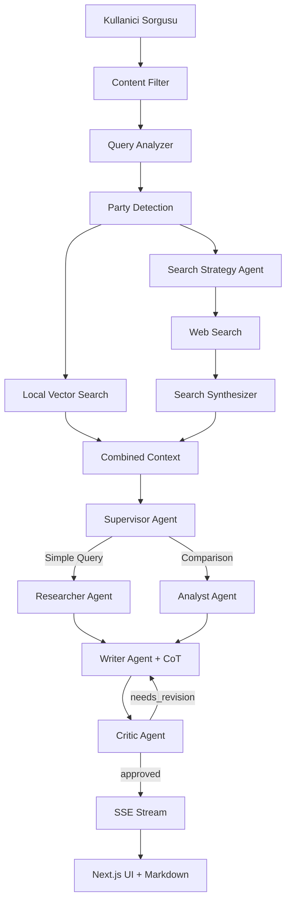

# mizan-ai

**Türk Siyasi Belgeleri için Tool-Augmented RAG (T-RAG) Multi-Agent Platform**

[](#)
[](https://www.python.org/downloads/)
[](https://www.langchain.com/)
[](https://langchain.dev/langgraph/)
[](https://nextjs.org/)
[](https://fastapi.tiangolo.com/)
[](LICENSE)

---

## Ozellikler (v7.0 - Advanced Multi-Agent T-RAG)

### Coklu-Ajan Mimarisi (LangGraph)

- **Supervisor Agent:** Kullanici sorgularini analiz eder ve dogru ajanlara yonlendirir
- **Researcher Agent:** Yerel vektor veritabani, web aramasi ve Wikipedia arastirmasi yapar
- **Analyst Agent:** Parti karsilastirmalari ve derin analiz yapar
- **Writer Agent:** Chain-of-Thought (CoT) ile yanit uretir
- **Critic Agent:** Kalite kontrol + revision loop (max 2 iterasyon)
- **Context Grader:** Dokuman alakaliligini puanlar (threshold: 0.3)

### Akilli Arama Pipeline

- **Query Analyzer:** Sorguyu alt sorulara ayirir, web gereksinimi belirler
- **Search Strategy Agent:** Sorgudan parti tespit eder, optimize arama sorgulari uretir
- **Search Synthesizer Agent:** Web sonuclarindan fact cikarir, alakasiz sonuclari filtreler
- **Party Detection:** Sorgudan otomatik parti tespiti (UI seciminden bagimsiz)

### Gelismis Arama Sistemleri

- **Yerel Veritabani:** ChromaDB vektor veritabani (parti bazli filtreleme)
- **Web Arama:** DuckDuckGo entegrasyonu + akilli sonuc filtreleme
- **Wikipedia:** Turkce/Ingilizce Wikipedia entegrasyonu
- **Kaynak Atiflandirma:** Her bilgi icin kaynak URL'si

### Real-Time Streaming

- **SSE (Server-Sent Events):** Cumle bazli streaming
- **Typing Indicator:** Yazim animasyonu
- **Markdown Rendering:** react-markdown ile zengin formatlama

### Guvenlik (Guardrail)

- **Content Filter:** Uygunsuz icerikleri engeller
- **CORS Kontrolu:** Sadece izinli origin'ler
- **JWT Authentication:** API guvenlik katmani
- **Input Sanitization:** XSS ve injection korumalari

### Esnek LLM Destegi

- **Ollama Modelleri:** qwen2.5:7b, kimi-k2.5:cloud, phi3, mistral, gemma3, llama3.2
- **Smart Fallback:** Ana model basarisiz olursa yedek modele gecer
- **Configurable:** config.py uzerinden model degisimi

---

## Mimari (Multi-Agent LangGraph + Search Pipeline)



---

## Kurulum

### Gereksinimler

- Python 3.10+
- Node.js 18+
- Ollama

### 1. Ollama Kurulumu

```bash
# Model indirme
ollama pull qwen2.5:7b

# veya cloud model icin
ollama login
ollama pull kimi-k2.5:cloud
```

### 2. Python Backend

```bash
# Virtual environment
python -m venv .venv
.venv\Scripts\activate  # Windows
source .venv/bin/activate  # Linux/Mac

# Bagimliliklari yukle
pip install -r requirements.txt

# Backend'i baslat
uvicorn src.api.main:app --reload --host 0.0.0.0 --port 8000
```

### 3. Next.js Frontend

```bash
cd web
npm install
npm run dev
```

Tarayicida acin: http://localhost:3000

### 4. Vercel'e Deploy

```bash
cd web
vercel deploy
```

---

## Proje Yapisi

```
mizan-ai/
├── web/                          # Next.js frontend (Vercel)
│   ├── app/
│   │   ├── page.tsx              # Ana sayfa
│   │   ├── chat/page.tsx         # Chat arayuzu (Markdown)
│   │   ├── layout.tsx            # Layout
│   │   └── api/chat/
│   │       └── stream/route.ts   # SSE streaming endpoint
│   ├── components/
│   │   └── TypingIndicator.tsx   # Yazim animasyonu
│   └── package.json
│
├── src/                          # Python backend
│   ├── config.py                 # LLM model yapilandirma
│   │
│   ├── agents/                   # LangGraph ajanlari
│   │   ├── graph.py              # Workflow + revision loop
│   │   ├── supervisor.py         # Sorgu yonlendirme
│   │   ├── researcher.py         # Arastirma ajani
│   │   ├── analyst.py            # Analiz ajani
│   │   ├── writer.py             # CoT yanit uretimi
│   │   ├── critic.py             # Kalite kontrol
│   │   ├── grader.py             # Context relevance grading
│   │   ├── tools.py              # RAG, Web, Wikipedia araclari
│   │   ├── prompts.py            # Sistem promptlari
│   │   └── state.py              # AgentState modeli
│   │
│   ├── core/                     # Temel moduller
│   │   ├── query_analyzer.py     # Alt soru uretimi
│   │   ├── search_agent.py       # Arama koordinasyonu
│   │   ├── search_strategy_agent.py   # Strateji belirleme
│   │   ├── search_synthesizer_agent.py # Sonuc sentezleme
│   │   ├── content_filter.py     # Icerik filtreleme
│   │   ├── parties.py            # Parti normalizasyonu
│   │   ├── llm_setup.py          # LLM kurulumu
│   │   ├── cache.py              # Vectorstore cache
│   │   └── duckduckgo_search.py  # Web arama
│   │
│   ├── api/                      # FastAPI
│   │   ├── main.py               # API entrypoint
│   │   ├── config.py             # CORS, JWT ayarlari
│   │   ├── routers/
│   │   │   └── query.py          # SSE streaming endpoint
│   │   └── services/
│   │       └── query_service.py  # Full pipeline service
│   │
│   └── app.py                    # Streamlit UI (legacy)
│
├── data/pdfs/                    # Parti belgeleri (PDF)
├── vector_db/                    # ChromaDB vektor veritabani
├── requirements.txt              # Python bagimliliklari
└── README.md
```

---

## API Endpoints

| Endpoint | Method | Aciklama |
|----------|--------|----------|
| `/api/v1/query` | POST | Sorgu isleme (SSE stream) |
| `/api/v1/query/compare` | POST | Parti karsilastirma |
| `/api/v1/query/analyze` | POST | Derin analiz |
| `/api/v1/parties` | GET | Desteklenen partiler |
| `/health` | GET | Saglik kontrolu |

---

## Desteklenen Partiler

| Parti | Tam Ad | Lider |
|-------|--------|-------|
| AKP | Adalet ve Kalkinma Partisi | Recep Tayyip Erdogan |
| CHP | Cumhuriyet Halk Partisi | Ozgur Ozel |
| MHP | Milliyetci Hareket Partisi | Devlet Bahceli |
| IYI | IYI Parti | Musavat Dervisoglu |
| DEM | Halklarin Esitlik ve Demokrasi Partisi | Tuncer Bakirhan, Tulay Hatimogullari |
| SP | Saadet Partisi | Temel Karamollaoglu |
| ZP | Zafer Partisi | Umit Ozdag |
| BBP | Buyuk Birlik Partisi | Mustafa Destici |

---

## Ornek Sorgular

```
# Kisi sorgulari (Wikipedia + Web)
"AKP genel baskani kimdir ve nasil secilir?"
"Mansur Yavas kimdir?"

# Parti politikalari (RAG)
"CHP'nin ekonomi politikasi nedir?"
"MHP'nin egitim programi"

# Karsilastirma (Analyst)
"AKP ve CHP'nin sosyal politikalarini karsilastir"

# Guncel bilgi (Web Search)
"DEM Parti kac belediye kazandi?"
```

---

## Konfigurasyonla

### LLM Model Degisimi

```python
# src/config.py
LLM_MODEL = "qwen2.5:7b"        # veya "kimi-k2.5:cloud"
LLM_TEMPERATURE = 0.1           # Deterministic output
```

### Context Grader Threshold

```python
# src/agents/grader.py
RELEVANCE_THRESHOLD = 0.3       # 0.0-1.0 arasi
```

### CORS Ayarlari

```python
# src/api/config.py
CORS_ORIGINS = ["http://localhost:3000", "https://your-domain.vercel.app"]
```

---

## Test

```bash
# Lint kontrolu
ruff check .

# Format kontrolu
black .

# Testleri calistir
pytest tests/

# API test
curl -X POST http://localhost:8000/api/v1/query \
  -H "Content-Type: application/json" \
  -d '{"question": "CHP genel baskani kimdir?"}'
```

---

## Katkida Bulunma

Bu proje Turk siyasi bilgilerine erisimi demokratiklestirmeyi amaclamaktadir:

- Yeni siyasi parti belgeleri ekleyin
- UI/UX iyilestirmeleri yapin
- Yeni agent'lar ekleyin
- Test coverage artirin

---

## Lisans

MIT License altinda dagitilmaktadir. Detaylar icin `LICENSE` dosyasina bakin.

**Gelistirici:** Baran Can Ercan

---

<div align="center">
  <b>mizan-ai v7.0</b><br>
  Turk Siyasi Belgeleri icin Advanced Multi-Agent RAG Platform
</div>
